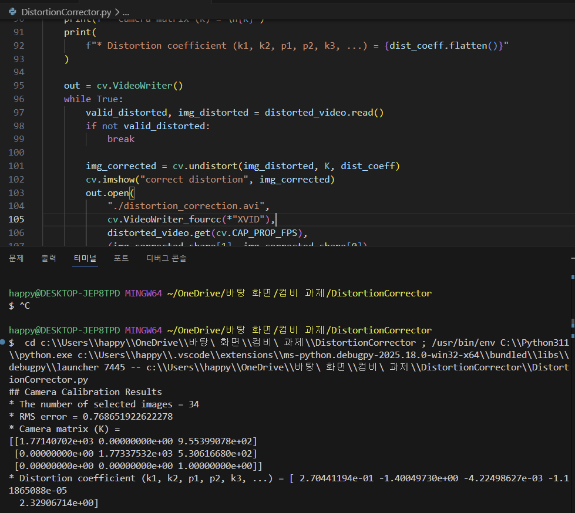
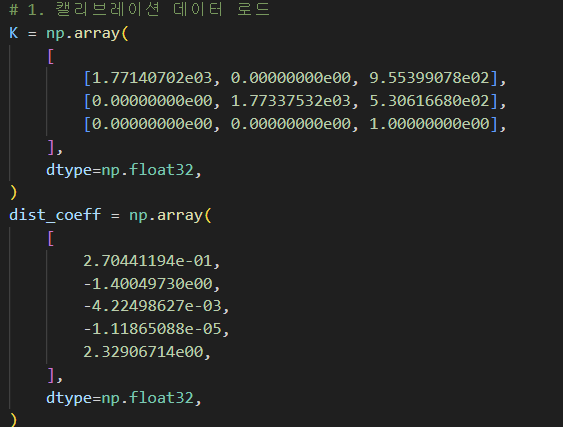
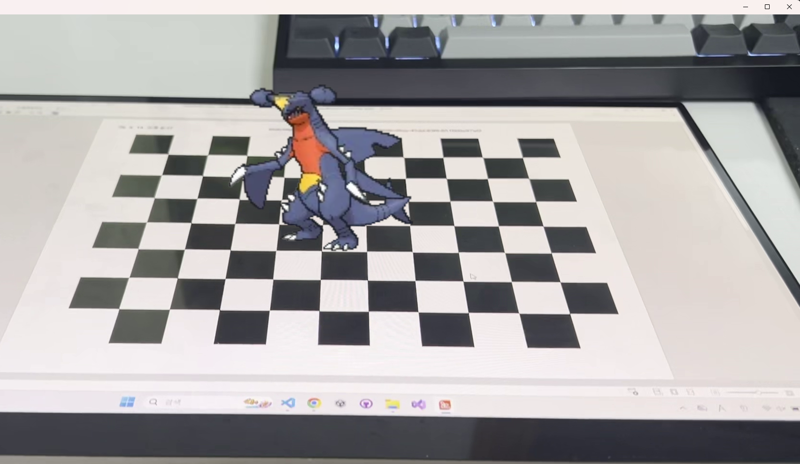

# pokemon-AR
OpenCV의 PnP를 활용하여 카메라의 Pose를 실시간으로 추적하고、 체스보드 좌표계 위에 포켓몬 AR 오브젝트를 렌더링
---

이전에 작성했던 DistrotionCorrector.py를 이용하여 캘리브레이션 데이터를 가져와서 코드의 K와 dist_coeff에 값을 넣어줌
| 캘리브레이션 데이터 | 가져온 데이터를 코드에다가 값을 설정 |
| --- | --- |
|  |  |

---
캘리브레이션된 영상 정보를 바탕으로 체스보드 위에 포켓몬 오브젝트를 투영

